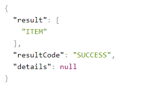
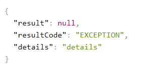

# BACKEND MODULE

### DOCUMENTATION API
url| application
-------------------------------------------|------------|
http://localhost:8080/swagger-ui/index.html| Trade-backend

FIGMA
https://www.figma.com/file/SKXegz852N92PZ7eOfKjaV/VOLUMENZEIT-~16000-19000

Моделька в ответе роута

Как видно на картинке resultCode 2 типа
- EXCEPTION
- SUCCESS
